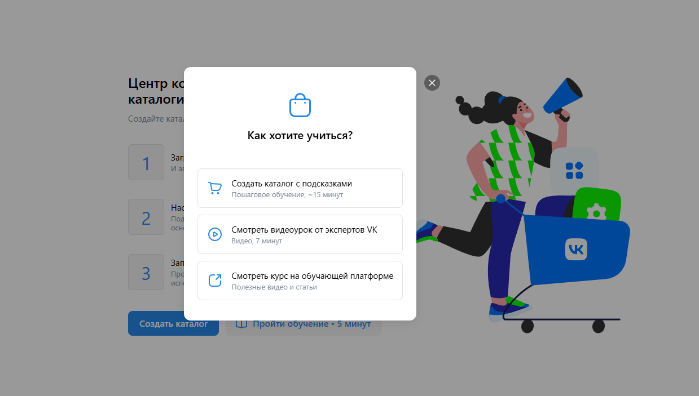
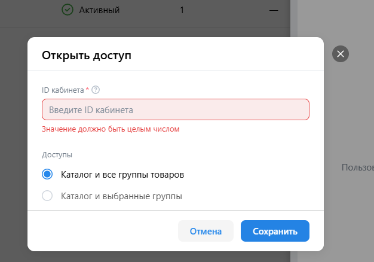

# Баланс, рекламные кампании и коммерческий центр

## Команда: **Gigachads**

## Содержание

1. [Коммерческий центр](#коммерческий-центр)
2. [Баланс](#Баланс)
3. [Добавление позиций](#добавление-позиций)
4. [Каталог создан](#каталог-создан)

# Коммерческий центр

URL: [https://ads.vk.com/hq/ecomm/catalogs](https://ads.vk.com/hq/ecomm/catalogs)

## Коммерческий центр

1. **Коммерческий центр.** При нажатии на крестик в углу или вне модального окна, окно закрывается.
2. **Коммерческий центр.** Нажав кнопку "Пройти обучение", появляется окно с тремя вариантами: "Создать каталог с подсказками", "Просмотр видеоурока от экспертов VK", "Изучить курс на обучающей платформе". 
3. **Коммерческий центр.** При клике на "Создать каталог" открывается модальное окно с формой для создания нового каталога. 
4. **Коммерческий центр.** Модальное окно с обучающими опциями закрывается при клике на крестик или за его пределами.

## Новый каталог

5. **Коммерческий центр. Новый каталог.** При выборе "Маркетплейс" появляется поле для ввода "Ссылки на страницу продавца". 
6. **Коммерческий центр. Новый каталог.** Ошибка, если название не введено после нажатия кнопки "Создать каталог". 
7. **Коммерческий центр. Новый каталог.** При выборе "Фид или сообщество" появляются: поле "Ссылка на фид или сообщество", select для "Периода обновления" и чек-бокс для удаления UTM-меток. 

## Добавление позиций. Маркетплейс

9. **Коммерческий центр. Добавление позиций. Маркетплейс.** После ввода корректной ссылки на продавца появляются поля для Client ID, API Key и select для "Периода обновления". 
10. **Коммерческий центр .Добавление позиций. Маркетплейс.** Выявляется ошибка при вводе кириллических символов в API Key. 
11. **Коммерческий центр. Добавление позиций. Маркетплейс.** Ошибка, если поле "Ссылка на страницу продавца" оставлено пустым при попытке создания каталога. 
12. **Коммерческий центр. Добавление позиций. Маркетплейс.** Ошибка, если введена не HTTP(S) ссылка. 
13. **Коммерческий центр. Добавление позиций. Маркетплейс.** При вводе корректной ссылки, если API key отсутствует – возникает ошибка. 

## Добавление позиций. Вручную

15. **Коммерческий центр. Добавление позиций. Вручную.** Ошибка при отсутствии выбора файла для фида после нажатия "Создать каталог". 

## Добавление позиций. Фид или сообщество

16. **Коммерческий центр. Добавление позиций. Фид или сообщество.** При отсутствии ссылки на фид или сообщество возникает ошибка после нажатия "Создать каталог". 
17. **Коммерческий центр. Добавление позиций. Фид или сообщество.** Ошибка:"Неверный статус HTTP-запроса"" при вводе ссылки на фид/сообщество, если ссылка нерабочая. 
18. **Коммерческий центр. Добавление позиций. Фид или сообщество.** После ввода правильной ссылки и нажатия "Создать каталог", происходит переход на страницу коммерческого центра с открытой историей загрузок. 

## С Каталогом

После создания каталога.

20. **Коммерческий центр. С Каталогом.** При наведении на кебаб-меню каталога отображаются опции "Настроить каталог" и "Удалить каталог". 
21. **Коммерческий центр. С Каталогом.** При нажатии на кнопку "Удалить каталог" появляется окно с подтверждением удаления, содержащее кнопки "Отменить" и "Удалить". 
22. **Коммерческий центр. С Каталогом. Настройка.** Если кликнуть Настроить каталог, то открывается менюшка настройки каталога с двумя разделами: Основные и Доступы, а также инпуты с названием, ссылкой на фид и с выбором периода обновления. 
23. Коммерческий центр. С Каталогом.Настройка. При вводе нового названия и нажатия на сохранить менюшка закрывается и название Каталога обновляется 
24. Коммерческий центр. С Каталогом. Настройка. При нажатии на раздел Доступы открывается меню с доспупами, изначально доступов нет, поэтому в центре раздела показывается кнопка Отрыть доступ. 
25. Коммерческий центр. С Каталогом.Настройка. При нажатии открыть доступ вылезает модальное окно с возможность добавить id кабинета и выбором доступа:
26. Коммерческий центр. С Каталогом.Настройка. При пустом вводе показывается ошибка: Значение должно быть целым числом
    
27. **Коммерческий центр. С Каталогом.Настройка.** При подтверждении удаления (нажатие на "Удалить") выбранный каталог окончательно удаляется. 

# Баланс

URL: [https://ads.vk.com/hq/budget/transactions](https://ads.vk.com/hq/budget/transactions)

1. Баланс. При переходе в раздел Баланс показывается два раздела: Транзакции и Бонусная программа, изначально активен раздел Транзакции внутри которого поцентру находится кнопка Пополнить Баланс.
2. Баланс. Транзакции. При нажатии на кнопку Пополнить баланс показывается модальное окно с дмуся инпутами: сумма к оплате и на баланс поступит, также кнопка Доступна акация с кпопкой пополнения баланса. 
3. Баланс. Транзакции. Пополнение баланса. При вводе суммы в поле Сумма к оплате автоматически в поле на баланс поступит вписывается сумма, которая на 20% меньше и наоборот. 
4. Баланс. Транзакции. Пополнение баланса. При вводе суммы меньше 600 вылезает ошибка о минимальной сумме.
5. Баланс. Транзакции. Пополнение баланса. Кропка пополнить баланс при нажатии переводит на шлюз оплаты с VK pay, где предлагатеся выбор карт для дальнейшей оплаты. 
6. Баланс. Бонусная Программа. При нажатии на раздел Бонусная программа появляется карточка с бонусным счетом пользователя в реблях, персональные акции и активированные промокоды, где по умолчанию написано, что нет активированных промокодов.
