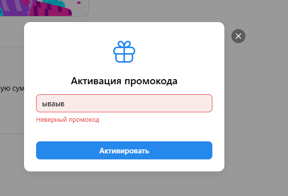

# Чек лист команды Гигачады.

## Участники
- [Софья Беляк](#софья-беляк)
- [Софья Проклашкина](#софья-проклашкина)
- [Николай Сычев](#николай-сычев)
- [Николай Танев](#николай-танев)

Эту часть делала: Софья Беляк

## Содержание:

- Сайты
- Мобильные приложения
- Лид-формы и опросы

# Сайты

URL: https://ads.vk.com/hq/pixels

После перехода на вкладку сайтов, выводится панель управления пикселями, которая позволяет создавать и настраивать пиксели для отслеживания конверсий на сайте.

1. При нажатии на кнопку "Добавить пиксель" открывается модальное окно с формой добавления нового пикселя.

2. Форма содержит два раздела для работы с пикселями:

## Домен сайта

Действия с модальным окном:

- Закрытие окна происходит при:
  - Нажатии на крестик в правом верхнем углу
  - Клике вне области модального окна
    

Работа с формой:

- Поле "Домен сайта":
  - До заполнения поля кнопка "Добавить пиксель" неактивна
    
  - При вводе некорректного URL появляется предупреждение об ошибке
    
  - При вводе несуществующего сайта появляется предупреждение об отсутствии сайта

    
  - После ввода корректного URL кнопка становится активной
    

Процесс создания:

- После успешного создания пикселя:

  - Отображается уведомление об успешном создании
  - Становится доступна кнопка "Получить код"
    
- При нажатии "Получить код":

  - Открывается новая вкладка
  - На странице отображается:
    - Ссылка на добавленный сайт,
    - Ползунки:
      1. Автоматический поиск событий
      2. Сбор событий из слоя данных
      3. Синхронизация пользователей
    - Код для установки пикселя
      

## ID пикселя

Работа с формой:

- Обязательные поля:

  - ID пикселя
  - Email владельца
    
- Валидация данных:

  - Кнопка "Запросить доступ" активируется только при заполнении обоих полей
    
  - При вводе некорректного email появляется сообщение об ошибке

    
  - При вводе ранее запрошенного счетчика, возникает окно об ошибке в левом углу странице
    
  - При воводе некорректного счетчика появляется сообщение об ошибки
    
  - После ввода корректных данных можно запросить доступ

## Поиск и управление пикселями

- Основное окно управления пикселями - отображает список всех созданных пикселей с возможностью фильтрации и поиска
  
- При вводе некорректного названия пикселя в поиске отображается пустой результат
  
- При вводе корректного названия пикселя отображаются все соответствующие результаты
  
- В переходе в настройки пикселем отображаются 6 разделов:

  1. События

  URL: https://ads.vk.ru/hq/pixels/3646103/events
  
  При нажатии на кнопку "Добавить событие" открывается модальное окно с формой добавления нового события.
  

  - Поля для заполнения:
    - Название события
    - Категория
  - Кнопки управления:
    - Выбор типа настройки события (вручную и в визуальном конструкторе)
    - "Отмена" - закрывает модальное окно без сохранения
    - "Добавить" - создает новое событие
  - Закрытие окна:
    - По клику вне области модального окна
      При заполнении поля Категории, всплывает окно выбора нужной категории
       После выбора Категории, возникает поле "Условие наступления"
      
      При вводе некорректного URL появляется предупреждение об ошибке
      
      После ввода полей кнопка "Добавить событие" становится активной
      
      После создания события отображается страница со списком событий:
      

  Интерфейс страницы событий:

  - Верхняя панель:
    - Кнопка "Добавить событие" для создания новых событий
    - Поле поиска для фильтрации событий
    - Ссылка "Как настроить офлайн-события" со справочной информацией
  - Таблица событий с колонками:
    - ID (с возможностью сортировки)
    - Категория и Название
    - Условие (с иконкой подсказки)
    - Ценность (с иконкой подсказки)
    - Событий за 7 дней
  - Разделы событий:
    - События визуального конструктора (с иконкой подсказки)
    - Автоматически найденные события (с иконкой подсказки)

  2. Код пикселя

  URL: https://ads.vk.ru/hq/pixels/3646103/code

  На странице отображается:

  - Ссылка на добавленный сайт,
  - Ползунки:
    1. Автоматический поиск событий
    2. Сбор событий из слоя данных
    3. Синхронизация пользователей
  - Код для установки пикселя
    

  3. Аудитория сайта

  - URL: https://ads.vk.ru/hq/pixels/3646103/portrait
  - Отображается сообщение "Недостаточно посетителей сайта"
  - Под сообщением указано условие: "Запросить портрет аудитории можно, если сайт посетило от 1000 пользователей за неделю"
  - Кнопка "Запросить":

    - Неактивна, если количество посетителей меньше 1000 за неделю
    - Становится активной только при достижении порога в 1000 уникальных посетителей за неделю
      

  4. Аудиторные теги

  - URL: https://ads.vk.ru/hq/pixels/3646103/tags
  - В верхней части отображается информационный блок с описанием функционала:
  - При отсутствии тегов отображается сообщение "Нет аудиторных тегов"
  - Кнопка "Создать аудиторный тег" открывает модальное окно создания нового тега
    

  При нажатии на кнопку "Создать аудиторный тег" открывается модальное окно:
  

  - Заголовок "Новый аудиторный тег"
  - Поле "Введите название тега"
  - Кнопки управления:
    - "Отмена" - закрывает модальное окно
    - "Создать" - создает новый тег
  - Окно можно закрыть, нажав на крестик в правом верхнем углу
    

  После создания тега отображается страница со списком аудиторных тегов:
  
  Интерфейс страницы аудиторных тегов:

  - Таблица тегов с колонками:
    - Название
    - Статус
    - Охват
    - Сегменты
    - Действия (кнопка "Копировать", "Посмотреть код" в виде всплывающей подсказки)

  5. Доступы

  URL:https://ads.vk.ru/hq/pixels/3646103/pixel_access

  

  Раздел "Доступы":

  - При первом входе отображается пустое состояние:
    - Заголовок "Вы пока не выдали ни одного доступа"
    - Описание функционала:
    - Кнопка "Выдать доступ"

  При нажатии на кнопку "Выдать доступ" открывается модальное окно:
  

  - Заголовок "Доступ к пикселю"
  - Поле "ID аккаунта, которому будет выдан доступ"
  - Подсказка о правах доступа
  - Кнопки:
    - "Отмена" - закрывает модальное окно
    - "Выдать доступ" - подтверждает действие

  При вводе некорректного ID аккаунта:
  

  - Появляется сообщение об ошибке красным цветом
  - Кнопка "Выдать доступ" остается активной

  6. Диагностика сайта

  URL: https://ads.vk.ru/hq/pixels/3646103/review

  

  Раздел "Диагностика сайта":

  - При первом входе отображается начальное состояние:
    - Заголовок "Диагностика ещё не проводилась"
    - Описание
    - Кнопка "Проверить сайт"

  При нажатии на кнопку "Проверить сайт" отображается процесс диагностики:
  

  - Заголовок "Проверяем сайт"
  - Статус
  - Отображается анимированная иконка процесса проверки

# Мобильные приложения

Начальная страница:

- При первом входе отображается пустое состояние:
  - Заголовок "Нет привязанных приложений"
  - Описание
  - Кнопка "Добавить приложение"

При нажатии на кнопку "Добавить приложение" открывается модальное окно:

- Заголовок "Привязка приложения"
- Поля для заполнения:
  - Ссылка на приложение
- Кнопки:
  - "Добавить" - создает новую приаязку приложения

При вводе некорректных данных:

- Отображается сообщение об ошибке
- Кнопка "Добавить" становится неактивной

Страница привязки приложения:

- Заголовок "Привязка приложения"
- Отображается информация о выбранном приложении
- Ссылка на справку "Как настроить приложение в трекере"
- Поле с кодом привязки
- Кнопка "Копировать"

После копирования кода:

- Кнопка "Копировать" меняет состояние на "Скопировано"
- Код остается видимым в поле

После успешной привязки приложение отображается в списке:

- Таблица с колонками:
  - Название приложения
  - Категория
  - Название трекера
  - Статус
- Внизу отображается итоговая информация: "Итого: 1 приложение"

# Лид-формы и опросы

URL: https://ads.vk.ru/hq/leadads/leadforms

## Лид-формы

- При переходе в раздел "Лид-формы" отображается список всех созданных форм или сообщение о том, что форм пока нет, с кнопкой "Создать лид-форму".
  

### Шаг 1. Оформление

- При нажатии на кнопку "Создать лид-форму" открывается окно создания новой формы.
- В окне отображаются обязательные поля:

  - Логотип (с возможностью загрузить или заменить)
  - Название компании
  - Заголовок формы
  - Описание формы
- Можно выбрать цветовую схему оформления.
- В правой части окна отображается предпросмотр внешнего вида формы.
- Кнопка "Продолжить" активна
- Переход на "Вопросы" становится возможным только после заполнения всех обязательных полей.
  
- При нажатии на "Вопросы" происходит переход к следующему шагу.

### Шаг 2. Вопросы

- При успешном заполнении полей можно продолжить
- Основные элементы:
  - Выбор стилей (палитра цветов)
  - Выбор логотипа (с опциями кадрировать, заменить)
  - Кнопка "Продолжить" активна
  - Кнопка "Отмена" для отмены создания
  - Можно добавить или удалить контактную информацию
    

### Шаг 3. Результат

Окно создания вопроса:

- Структура вопроса:
  - Заголовок "Вопрос № 1" (с возможностью удаления)
  - Поле для текста вопроса
  - Выбор типа вопроса: "Выбор одного ответа"
  - Варианты ответов:
  - Кнопка "Добавить ответ"
  - Опция "Ответ из шаблона"
- Кнопка "Добавить вопрос" внизу страницы

### Шаг 4. Настройки

- На этом шаге доступны:
  - Настройки уведомлений (отправка на email, в VK Messenger)
  - Включение обязательных вопросов
  - Согласие на обработку персональных данных (с обязательными полями)
- В правой части окна отображается предпросмотр итогового экрана формы.
- Кнопка "Сохранить" становится активной после заполнения всех обязательных полей.
- Кнопка "Назад" возвращает к предыдущему шагу.

### После создания формы

- Форма появляется в общем списке лид-форм.
- В таблице отображаются:
  - Название формы
  - Дата создания
  - Статус
  - Количество ответов
- Доступен поиск, фильтрация и создание новых форм.

## Формы YCLIENTS

https://ads.vk.ru/hq/leadads/yclients

- Верхняя панель с разделами:
  - Лид-формы
  - Формы YCLIENTS (активный)
  - Опросы
- При переходе в раздел "Формы YCLIENTS":
  - Отображается заголовок "Продвигайте формы онлайн-записи через VK Рекламу"
  - Указано "Всего в 2 шага"
  - Шаг 1 "Подключите YCLIENTS":
    - Описание "В разделе интеграций YCLIENTS найдите VK Рекламу и нажмите «Подключить»"
    - Кнопка "Перейти в YCLIENTS"
  - Шаг 2 "Вставьте код":
    - Описание "Скопируйте код из YCLIENTS и вставьте сюда"
    - Поле для ввода кода
    - Кнопка для отправки кода

## Опросы

- При переходе в раздел "Опросы":
  - При отсутствии созданных опросов отображается сообщение "У вас пока нет опросов"
  - Описание: "Используйте опросы, чтобы собирать мнения и обратную связь от клиентов или провести исследование рынка"
  - Кнопка "Создать опрос" для создания нового опроса
- При нажатии на кнопку "Создать опрос" открывается окно создания нового опроса.

### Шаг 1. Оформление

- В окне отображаются обязательные поля:
  - Название опроса
  - Логотип (с возможностью загрузить или заменить)
  - Название компании
  - Заголовок опроса
  - Описание опроса
- Можно выбрать цветовую схему оформления.
- В правой части окна отображается предпросмотр внешнего вида опроса.
- Кнопка "Вопросы" становится активной только после заполнения всех обязательных полей.
- При нажатии на "Вопросы" происходит переход к следующему шагу.

### Шаг 2. Вопросы

- В верхней части окна отображается прогресс по шагам: Оформление — Вопросы — Результат.
- Можно добавить вопросы к опросу:
  - Для каждого вопроса выбирается тип (например, "Один из списка").
  - Добавляются варианты ответов.
  - Можно использовать шаблонные ответы ("Другое", "Ничего из перечисленного", "Затрудняюсь ответить", "Свой вариант").
- Доступна кнопка "Добавить вопрос" для создания дополнительных вопросов.
- Можно добавить стоп-экран.
- Кнопка "Результат" становится активной после добавления хотя бы одного вопроса.
- Кнопка "Назад" возвращает к предыдущему шагу.

### Шаг 3. Результат

- На этом шаге настраивается страница благодарности:
  - Поля "Заголовок" и "Описание" (например, "Спасибо за ответы!", "Заявка отправлена").
  - Можно добавить ссылку.
- В правой части окна отображается предпросмотр итогового экрана.
- Кнопка "Запустить опрос" становится активной после заполнения всех обязательных полей.
- Кнопка "Назад" возвращает к редактированию вопросов.

### После запуска опроса

- Опрос появляется в общем списке опросов.
- В таблице отображаются:
  - Название опроса
  - Статус (например, "Активен")
  - Количество анкет
  - Дата создания
  - ID опроса
- Доступен поиск, фильтрация и создание новых опросов.

---

# Чек лист. Команда Гигачады

Сделала эту часть: Софья Проклашкина

## Содержание

- Аудитория
- Обзор

## Аудитория

Ссылка https://ads.vk.com/hq/audience
``
При отсутствии аудиторий, в центральном окне отображается надпись "Аудиторий пока нет" и появляется синяя кнопка Создать аудиторию, кнопка с тремя точками и ссылка "Как работают аудитории"
``
При нажатии на кнопку Создать аудиторию открывается модальное окно Создание аудитории с полем для ввода названия, кнопкой Добавить источник и кнопкой Исключить источник, кнопкой Сохранить и Отмена, кнопкой со знаком вопроса
``
При нажатии на кнопку Добавить источник или Исключить источник появляется окно Добавить источник или Исключить источник с разделами Мои аудитории: Уже созданная аудитория, Список пользователей; По событиям или реакциям пользователей: События в моих объявлениях, События в мобильном приложении, События в лид-форме, События на сайте; По интересам: Вводили ключевые фразы, Подписчики сообществ, Слушатели музыкантов, Пользуются VK Mini Apps или играют ВКонтакте. У каждого раздела есть знак вопроса с ссылкой и кратким описанием.
``
При нажатии на кнопку Уже созданная аудитория появляется окно с полем для выбора и кнопки Сохранить и Отмена.
``
``
При нажатии на кнопку Список пользователей появляется окно с двумя разделами: Выбрать существующий и Загрузить новый. В разделе Выбрать существующий поле выбора и кнопка Расширить. В разделе Загрузить новый поле для ввода названия, галочка Как имя файла, поле с выбором типа и окно с загрузкой файла. В обоих разделах кнопки Сохранить и Отмена.
``
При нажатии на кнопку События в моих объявлениях появляется окно с полем выбора групп и полем выбора события, кнопки Сохранить и Отмена.
``
При нажатии на кнопку События в мобильном приложении появляется окно с полем выбора приложения, кнопки Сохранить и Отмена.
``
При нажатии на кнопку Категории мобильного приложения появляется окно с полем выбора мобильной платформы и категории, кнопки Сохранить и Отмена.
``
При нажатии на кнопку События в лид-форме появляется окно с полем выбора лид-формы, кнопки Сохранить и Отмена.
``
При нажатии на кнопку События на сайте появляется окно с полем выбора пикселя, кнопки Сохранить и Отмена.
``
При нажатии на кнопку Вводили ключевые фразы появляется окно с полем ввода названия, ключевых фраз, минус-фраз и периода поиска, кнопки Сохранить и Отмена.
``
При нажатии на кнопку Подписчики сообществ появляется окно с полем выбора Сообществ, кнопки Сохранить и Отмена.
``
При нажатии на кнопку Слушатели музыкантов появляется окно с полем выбора музыканта, кнопки Сохранить и Отмена.
``
При нажатии на кнопку Пользуются VK Mini Apps или играют ВКонтакте появляется окно с полем выбора названия мини-приложения или игры
``
При нажатии кнопки сохранить в любом из разделов с заполненными полями на главной странице окна Создание аудитории появляется блок источника с кнопкой редактирования и удаления, кнопкой выбора условий.
``
При нажатии на кнопку выбора условий появляется модальное окно с выбором из 2х вариантов Всем условиям или Любым условиям
``
При нажатии на кнопку удалить (корзина) появляется окно с кнопками Отменить и Удалить
``
При нажатии на кнопку удалить блок удаляется
``
При нажатии на кнопку Сохранить без добавленных источников сохранение аудитории не происходит
``
На главной странице аудитории при нажатии на кнопку Активировать внешнюю аудиторию появляется окно с полем ввода ключа и кнопкой активировать
При нажатии на кнопку активировать с пустым полем активация не происходит
При вводе несуществующего ключа поле становится красным
``
При нажатии на кнопку Сохранить в разделе Создать аудиторию на главной странице аудиторий появляется строка с полями названия созданной аудитории, охвата, Используется, типа, владельца и доступа.
Также пояляются кнопки Фильтр, Переслать и Удалить, поле поиска по аудиториям
При выборе (нажатии на галочку у одной из строк) активируются кнопки Переслать и Удалить (изменяют цвет)
``
При нажатии на кнопку поделиться появляется окно с выбором ключа по галочке и полем ввода айди кабинета, кнопками Сохранить и Отменить
``
При нажатии на кнопку Удалить появляется окно с выбором Отменить Удалить
При нажатии на кнопку удалить выделенная строка удаляется
``
При переходе в раздел Списки пользователей при отсутствии списков появляется окно Списков пользователей пока нет с кнопкой Загрузить список, кнопкой с точками и ссылкой Как работают списки пользователей
``
При нажатии на кнопку с точками появляется ссылка Активировать список пользователей, при нажатии на нее появляется окно с полем ввода ключа и кнопкой активации
``
При нажатии на кнопку Загрузить список появляется окно с полем ввода названия, галочкой Как имя файла, полем выбора типа списка и кнопкой загрузки файла, кнопкой Сохранить и Отмена
``
При переходе в раздел Офлайн-конверсии при отсутствии списков появляется окно Списков офлайн-конверсий пока нет, кнопкой Загрузить список и ссылкой Как работают списки офлайн-конверсий.
``
При нажатии на кнопку загрузить список пользователей появляется окно с 2 разделами - Создать новый и Добавить в существующий, кнопкой отмены.
``
При нажатии на кнопку Создать новый появляется окно с полем ввода названия, галочкой Как имя файла, полем выбора типа и полем ввода Окна атрибуции, окном загрузки файла и кнопками Сохранить, Отмена
``
При нажатии на кнопку Добавить в существующий появляется окно с полем ввода названия, полем выбора типа и полем ввода окна атрибуции, окном загрузки файла и кнопками Сохранить и Отмена

## Обзор

Ссылка https://ads.vk.ru/hq/overview
``
На главной странице появляется надпись Добро пожаловать и 2 окна Создать кампании вручную и Запустить рекламу у блогеров с кнопками Создать вручную и Открыть VK AdBlogger
Ниже окно Обзор кампаний. При отсутствии кампаний появляется надпись Здесь будет обзор кампаний

---

 Чек лист команды Гигачады.

Сделал эту часть: Сычев Николай

## Содержание:
- Главная страница
- Новости
- Полезные материалы
- Меропирятия
- Документы
- Кейсы

# Главная страница

https://ads.vk.ru/

- При нажатии на кнопку "Новости" открывается страница новостей https://ads.vk.ru/news.
- При нажатии на кнопку "Кейсы" открывается страница кейсов https://ads.vk.ru/cases.
- При нажатии на кнопку "Форум идей" открывается страница форума идей https://ads.vk.ru/upvote.
- При нажатии на кнопку "Монетизация" открывается страница монетизации https://ads.vk.ru/partner.
- При нажатии на кнопку "Справка" открывается страница помощи https://ads.vk.ru/help.
- При нажатии на кнопку "Регистрация" открывается страница регистрации.

- При нажатии на кнопку "Запустить рекламу" открывается страница регистрации.

- При нажатии на кнопку "Получить бонус" открывается страница бонусов https://ads.vk.ru/promo/firstbonus.

- При нажатии на кнопку "Открыть подборку" открывается страница подборки https://ads.vk.ru/cases/podborka-100-kejsov-vk-reklamy.

- При нажатии на кнопку "Смотреть все" в разделе кейсов открывается страница кейсов.
- При нажатии на карточку кейса открывается его полный текст.

- При нажатии на кнопку "Подробнее" на карточке "Обучающие вебинары" открывается страница мероприятий https://ads.vk.ru/events.

- При нажатии на кнопку "Подробнее" на карточке "Новости" открывается страница новостей.

- При нажатии на кнопку "Новости" открывается страница новостей https://ads.vk.ru/news.
- При нажатии на кнопку "Полезные материалы" открывается страница полезных материалов https://ads.vk.ru/insights.
- При нажатии на кнопку "Мероприятия" открывается страница мероприятий.
- При нажатии на кнопку "Документы" открывается страница документов.
- При нажатии на кнопку "Обучение для бизнеса" открывается страница обучающей платформы https://expert.vk.com/.
- При нажатии на кнопку "Помощь" открывается страница помощи https://ads.vk.ru/help.
- При нажатии на кнопку "Кейсы" открывается страница кейсов https://ads.vk.ru/cases.
- При нажатии на кнопку "Монетизация" открывается страница монетизации https://ads.vk.ru/partner.

# Новости

https://ads.vk.ru/news

- При нажатии на кнопку "Подробнее" открывается подробное описание новости.

- При нажатии на карточку новости открывается ее полный текст.

- При нажатии на номер страницы открывается эта страница новостей.

# Полезные материалы

https://ads.vk.ru/insights

- При нажатии на кнопку "Подробнее" открывается подробное описание статьи.

- При нажатии на карточку статьи открывается ее полный текст.

- При нажатии на номер страницы открывается эта страница полезных материалов.

# Мероприятия

https://ads.vk.ru/events

- При нажатии на кнопку "Подробнее" открывается подробное описание мероприятия.

# Документы

https://ads.vk.ru/documents

- При нажатии на карточку документа открывается его полный текст.

# Кейсы

https://ads.vk.ru/cases

- При нажатии на кнопку "Подробнее" открывается подробное описание кейса.

- При нажатии на карточку кейса открывается его полный текст.

- При нажатии на номер страницы открывается эта страница кейсов.

---

# Баланс, рекламные кампании и коммерческий центр

## Кто сделал: **Танев Николай**

## Содержание

1. [Коммерческий центр](#коммерческий-центр)
2. [Баланс](#Баланс)
3. [Компании](#Компании)

# Коммерческий центр

URL: [https://ads.vk.com/hq/ecomm/catalogs](https://ads.vk.com/hq/ecomm/catalogs)

## Коммерческий центр

1. **Коммерческий центр.** При нажатии на крестик в углу или вне модального окна, окно закрывается.
2. **Коммерческий центр.** Нажав кнопку "Пройти обучение", появляется окно с тремя вариантами: "Создать каталог с подсказками", "Просмотр видеоурока от экспертов VK", "Изучить курс на обучающей платформе". 
3. **Коммерческий центр.** При клике на "Создать каталог" открывается модальное окно с формой для создания нового каталога. 
4. **Коммерческий центр.** Модальное окно с обучающими опциями закрывается при клике на крестик или за его пределами.

## Новый каталог

5. **Коммерческий центр. Новый каталог.** При выборе "Маркетплейс" появляется поле для ввода "Ссылки на страницу продавца". 
6. **Коммерческий центр. Новый каталог.** Ошибка, если название не введено после нажатия кнопки "Создать каталог". 
7. **Коммерческий центр. Новый каталог.** При выборе "Фид или сообщество" появляются: поле "Ссылка на фид или сообщество", select для "Периода обновления" и чек-бокс для удаления UTM-меток. 

## Добавление позиций. Маркетплейс

9. **Коммерческий центр. Добавление позиций. Маркетплейс.** После ввода корректной ссылки на продавца появляются поля для Client ID, API Key и select для "Периода обновления". 
10. **Коммерческий центр .Добавление позиций. Маркетплейс.** Выявляется ошибка при вводе кириллических символов в API Key. 
11. **Коммерческий центр. Добавление позиций. Маркетплейс.** Ошибка, если поле "Ссылка на страницу продавца" оставлено пустым при попытке создания каталога. 
12. **Коммерческий центр. Добавление позиций. Маркетплейс.** Ошибка, если введена не HTTP(S) ссылка. 
13. **Коммерческий центр. Добавление позиций. Маркетплейс.** При вводе корректной ссылки, если API key отсутствует – возникает ошибка. 

## Добавление позиций. Вручную

15. **Коммерческий центр. Добавление позиций. Вручную.** Ошибка при отсутствии выбора файла для фида после нажатия "Создать каталог". 

## Добавление позиций. Фид или сообщество

16. **Коммерческий центр. Добавление позиций. Фид или сообщество.** При отсутствии ссылки на фид или сообщество возникает ошибка после нажатия "Создать каталог". 
17. **Коммерческий центр. Добавление позиций. Фид или сообщество.** Ошибка:"Неверный статус HTTP-запроса"" при вводе ссылки на фид/сообщество, если ссылка нерабочая. 
18. **Коммерческий центр. Добавление позиций. Фид или сообщество.** После ввода правильной ссылки и нажатия "Создать каталог", происходит переход на страницу коммерческого центра с открытой историей загрузок. 

## С Каталогом

После создания каталога.

20. **Коммерческий центр. С Каталогом.** При наведении на кебаб-меню каталога отображаются опции "Настроить каталог" и "Удалить каталог". 
21. **Коммерческий центр. С Каталогом.** При нажатии на кнопку "Удалить каталог" появляется окно с подтверждением удаления, содержащее кнопки "Отменить" и "Удалить". 
22. **Коммерческий центр. С Каталогом. Настройка.** Если кликнуть Настроить каталог, то открывается менюшка настройки каталога с двумя разделами: Основные и Доступы, а также инпуты с названием, ссылкой на фид и с выбором периода обновления. 
23. Коммерческий центр. С Каталогом.Настройка. При вводе нового названия и нажатия на сохранить менюшка закрывается и название Каталога обновляется 
24. Коммерческий центр. С Каталогом. Настройка. При нажатии на раздел Доступы открывается меню с доспупами, изначально доступов нет, поэтому в центре раздела показывается кнопка Отрыть доступ. 
25. Коммерческий центр. С Каталогом.Настройка. При нажатии открыть доступ вылезает модальное окно с возможность добавить id кабинета и выбором доступа:
26. Коммерческий центр. С Каталогом.Настройка. При пустом вводе показывается ошибка: Значение должно быть целым числом
    
27. **Коммерческий центр. С Каталогом.Настройка.** При подтверждении удаления (нажатие на "Удалить") выбранный каталог окончательно удаляется. 

# Баланс

URL: [https://ads.vk.com/hq/budget/transactions](https://ads.vk.com/hq/budget/transactions)

1. Баланс. При переходе в раздел Баланс показывается два раздела: Транзакции и Бонусная программа, изначально активен раздел Транзакции внутри которого поцентру находится кнопка Пополнить Баланс.
2. Баланс. Транзакции. При нажатии на кнопку Пополнить баланс показывается модальное окно с дмуся инпутами: сумма к оплате и на баланс поступит, также кнопка Доступна акация с кпопкой пополнения баланса. 
3. Баланс. Транзакции. Пополнение баланса. При вводе суммы в поле Сумма к оплате автоматически в поле на баланс поступит вписывается сумма, которая на 20% меньше и наоборот. 
4. Баланс. Транзакции. Пополнение баланса. При вводе суммы меньше 600 вылезает ошибка о минимальной сумме.
5. Баланс. Транзакции. Пополнение баланса. Кропка пополнить баланс при нажатии переводит на шлюз оплаты с VK pay, где предлагатеся выбор карт для дальнейшей оплаты. 
6. Баланс. Бонусная Программа. При нажатии на раздел Бонусная программа появляется карточка с бонусным счетом пользователя в реблях, персональные акции и активированные промокоды, где по умолчанию написано, что нет активированных промокодов.
7. Баланс. Бонусная Программа. При нажатии на кнопку активировать промокод появляется модальное окно с инпутом для ввода значения промокода и кнопка активировать.
8. Баланс. Бонусная Программа. При нажатии на крестик, либо на вне модального окна модальное окно закрывается.
9. Баланс. Бонусная Программа. При нажатии на Активировать появляется дополнительное модальное окно с уведомленим о политики промокодов и акций, появляются копки отменить и продолжить. 
10. На кнопку продолжить происходит сабмит формы со значением промокода, если ввод пустой, показывается ошибка о пустом вводе.
11. На кнопку продолжить происходит сабмит формы со значением промокода, если ввод невалидный, показывается ошибка о неверном промокоде.

# Компании

URL: [https://ads.vk.com/hq/dashboard](https://ads.vk.com/hq/dashboard)

1. Компании. При переходе в раздел Компании при отсутсвии компаний показывается кнопка создать компанию.
2. Компании. При нажатии на кнопку создать компанию показывается меню с подробным выбором Целевых действий, Узнаваемости и охвата, а также возможность выбора раздела создания Смарт-компании. 
